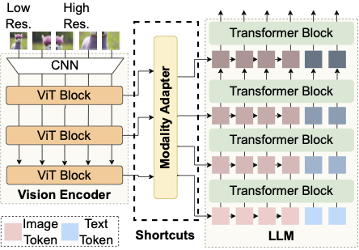
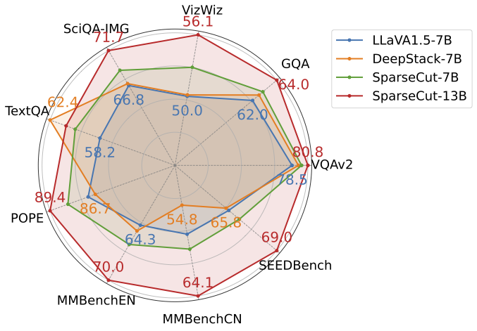

# SparseCut: A General, Efficient Fusion Architecture for Multimodal Large Language Models

---
[Paper(Arxiv)](https://www.arxiv.org/abs/2602.00505) |

In this work, we propose SparseCut, a general & efficient cross-modal fusion architecture of MLLM with shortcut connnections for multi-level multi-grained feature integration.


## SparseCut

---
<p align="center">
  
  
</p>

## Table of Contents
1. [Installation](#Installation)
2. [Training&Evaluation](#Training&Evaluation)
---

## Installation
1. Clone this repository and install packages
```zsh
git clone https://github.com/DistriAI/SparseCut.git
cd SparseCut
pip install --upgrade pip  # enable PEP 660 support
pip install -e .
```
2. Install additional packages for training cases
```zsh
pip install -e ".[train]"
pip install flash-attn --no-build-isolation
```

## Training&Evaluation

The training datasets and evaluation benchmarks used in SparseCut follow the standard protocols of LLaVA.

Please refer to the official [LLaVA Data Preparation Instructions](https://github.com/haotian-liu/LLaVA/blob/main/docs/Data.md) for detailed steps on:
* **Training Datasets**: Including SFT data and pretraining alignment data.
* **Evaluation Benchmarks**: Such as MME, MMBench, SEED-Bench, and LLaVA-Bench.

Ensure the data structure is organized as per LLaVA's requirements before starting the training or inference process.

### Training
```pycon
bash pretrain.sh
bash finetune.sh
```
### Evaluation
```pycon
bash ./benchmark_scripts/gqa.sh
bash ./benchmark_scripts/mme.sh
...
```
